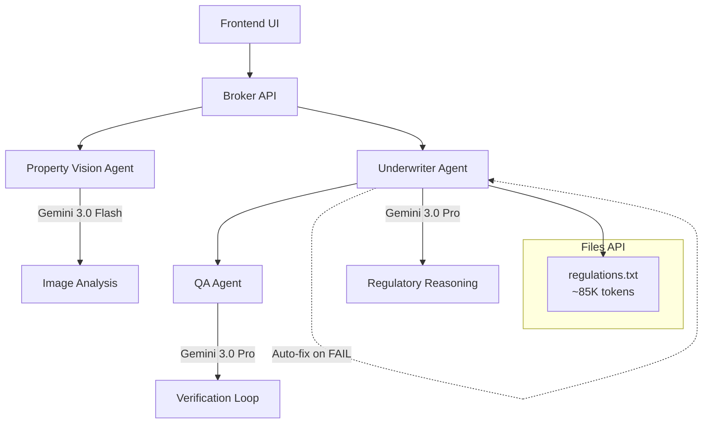

# Gemini Mortgage Concierge 🏠

> **Gemini 3 AI Developer Competition** | January 2026

Automated mortgage pre-qualification using **Gemini 3** multimodal vision, the **1M context window** via Files API, and an **autonomous self-correction loop**.

---

## ✨ Gemini 3 Features

| Feature | Implementation | Model |
|---------|----------------|-------|
| **Multimodal Vision** | Analyzes property image bytes via `inlineData` | Gemini 3.0 Flash |
| **1M Context Window** | Loads 85K+ token regulation handbook via Files API | Gemini 3.0 Pro |
| **Self-Correction** | QA Agent verifies decisions, triggers auto-fix on errors | Gemini 3.0 Pro |

---

## 🏗️ Architecture



**No Camunda/Zeebe required** — Pure Gemini 3 agents with local orchestration.

---

## 🚀 Quickstart

### Prerequisites
- Node.js 18+
- [Gemini API Key](https://aistudio.google.com/app/apikey)

### Setup

```bash
# 1. Configure environment
cp .env.example .env
# Edit .env with your GEMINI_API_KEY

# 2. Start all services
chmod +x start.sh && ./start.sh

# 3. Open browser (if frontend available)
open http://localhost:8100/projects/gemini-mortgage
```

### Smoke Test

```bash
# Check broker health
curl http://localhost:4020/health
# Expected: {"status":"ok","mode":"standalone"}

# Check agents
curl http://localhost:4023/.well-known/agent-card.json | jq '.name'
# Expected: "Property Vision Agent"

curl http://localhost:4001/.well-known/agent-card.json | jq '.name'
# Expected: "Underwriter Agent"
```

### Sample Analysis

```bash
curl -X POST http://localhost:4020/api/gemini-wizard \
  -H "Content-Type: application/json" \
  -d '{
    "borrower": {
      "name": "Alice Chen",
      "income": 95000,
      "monthlyDebts": 2500,
      "creditScore": 720,
      "propertyPrice": 350000
    },
    "property": {
      "inputType": "demo",
      "videoUrl": "https://www.youtube.com/watch?v=pQrS_qTv3M0"
    }
  }'
```

---

## 📁 Structure

```
gemini-mortgage-concierge/
├── agents/
│   ├── property-vision/   # Gemini 3.0 Flash - Image analysis
│   ├── underwriter/       # Gemini 3.0 Pro + Files API
│   └── qa-agent/          # Autonomous verification
├── broker/                # Standalone orchestrator
├── frontend/              # React UI (optional)
├── docs/                  # Documentation
├── testdata/              # Sample inputs
├── demo-assets/           # Sample images
├── start.sh               # One-command startup
└── .env.example           # Environment template
```

---

## 💡 Why This is NOT a Chat Wrapper

1. **Real Multimodal** — Image bytes via `inlineData`, not URL descriptions
2. **Files API Context** — Entire regulation handbook loaded, not RAG chunks
3. **Multi-Agent Architecture** — Specialized agents with clear contracts
4. **Self-Correction Loop** — QA catches and fixes hallucinations autonomously
5. **Production Contracts** — JSON-RPC 2.0, agent cards, structured outputs

---

## 🛠️ Troubleshooting

| Issue | Solution |
|-------|----------|
| `GEMINI_API_KEY not found` | Add to `.env` file |
| Agent timeout | Check logs: `tail -f *.log` |
| Port in use | `pkill -f 'property-vision\|underwriter\|qa-agent'` |
| Model unavailable | Falls back to `gemini-2.0-flash-exp` |

---

## 📚 Documentation

- [JUDGES.md](docs/JUDGES.md) — One-page judge guide
- [VIDEO_SCRIPT.md](docs/VIDEO_SCRIPT.md) — Demo narration
- [TESTING.md](docs/TESTING.md) — Test commands
- [DEVPOST_SUBMISSION.md](docs/DEVPOST_SUBMISSION.md) — Submission content
