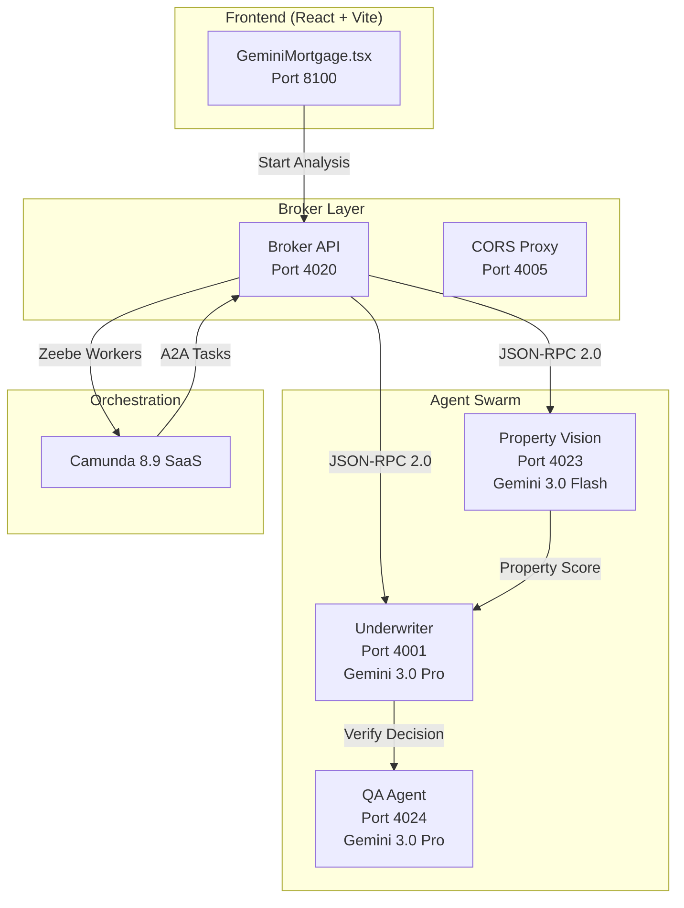
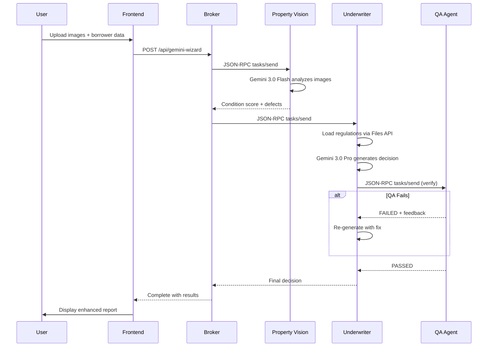

# Gemini Mortgage Concierge — Architecture

> **Gemini 3 Hackathon Submission** | Last Updated: 2026-01-19

---

## Executive Summary

A **multi-agent swarm** for mortgage pre-qualification, showcasing three flagship Gemini 3 capabilities:

| Feature | Implementation |
|---------|----------------|
| **Multimodal Vision** | Property Vision Agent uses Gemini 3.0 Flash to analyze actual property images |
| **1M Context Window** | Underwriter Agent loads entire Fannie Mae handbook (~85K tokens) via Files API |
| **Autonomous Self-Correction** | QA Agent verifies decisions and triggers automatic re-analysis if errors found |



---

## Repository Structure

```
mortgage-concierge-gemini/
├── broker/                  # Central orchestration service
│   ├── src/
│   │   └── index.ts        # Zeebe workers + A2A proxy (1199 lines)
│   ├── resources/          # BPMN process definitions
│   └── package.json        # Express, Camunda SDK, OpenAI
│
├── property-vision/         # Multimodal property analysis
│   ├── src/index.ts        # Gemini 3.0 Flash integration
│   ├── agent-card.json     # A2A capability manifest
│   └── package.json        # @google/generative-ai
│
├── underwriter/             # Financial risk assessment
│   ├── src/index.ts        # Gemini 3.0 Pro + Files API
│   ├── regulations.txt     # Fannie Mae excerpts (~85K tokens)
│   ├── agent-card.json     # A2A capability manifest
│   └── package.json        # GoogleAIFileManager
│
├── qa-agent/                # Autonomous verification loop
│   ├── src/index.ts        # Decision auditing
│   └── agent-card.json     # A2A capability manifest
│
├── scripts/                 # Deployment & testing utilities
│   ├── deploy-bpmn.js      # Deploy to Camunda 8.9 SaaS
│   └── test-e2e.js         # End-to-end validation
│
├── demo-assets/             # Sample images for demos
├── docs/                    # Documentation
│   ├── ARCHITECTURE.md     # This file
│   └── DEMO_WALKTHROUGH.md # Judge demo script
│
└── start-gemini-swarm.sh   # One-command startup
```

---

## Agent Architecture

### 1. Property Vision Agent (Port 4023)

**Model:** Gemini 3.0 Flash (Preview)

**Capabilities:**
- Analyzes up to 5 property images in parallel
- Identifies defects: water damage, mold, structural cracks, outdated systems
- Returns condition score (1-10) with detailed reasoning

**Agent Card:**
```json
{
  "name": "Property Vision Agent",
  "version": "1.0.0",
  "description": "Analyzes property images using Gemini 3 Flash",
  "url": "http://localhost:4023",
  "capabilities": [
    {
      "name": "AnalyzePropertyVideo",
      "parameters": {
        "videoUrl": "string",
        "images": "string[] (base64)"
      }
    }
  ]
}
```

**Input Modes:**
- `images` — Real multimodal analysis of uploaded base64 images
- `listing` — Scrapes and analyzes images from real estate listing URL
- `demo` — Simulated analysis for quick demonstrations (labeled)

---

### 2. Underwriter Agent (Port 4001)

**Model:** Gemini 3.0 Pro (Preview)

**Key Feature:** Uses **Files API** to load the Fannie Mae Selling Guide (~85K tokens) into the 1M context window.

**Capabilities:**
- Calculates DTI ratio with proper percentage formatting
- Cites specific regulations (B3-6-02, B4-1-01, etc.)
- Integrates property condition score into final decision

**Agent Card:**
```json
{
  "name": "Underwriter Agent",
  "version": "1.0.0",
  "description": "Analyzes financial data against Fannie Mae regulations",
  "url": "http://localhost:4001",
  "capabilities": [
    {
      "name": "AnalyzeRisk",
      "parameters": {
        "income": "number",
        "monthlyDebts": "number",
        "creditScore": "number",
        "propertyCondition": "string"
      }
    }
  ]
}
```

**Files API Integration:**
```typescript
// On startup, upload regulation file
const uploadResult = await fileManager.uploadFile(regulationPath, {
  mimeType: "text/plain",
  displayName: "Fannie Mae Selling Guide"
});
regulationFileUri = uploadResult.file.uri;

// In requests, reference the uploaded file
const response = await model.generateContent([
  { fileData: { mimeType: "text/plain", fileUri: regulationFileUri } },
  { text: "Analyze against regulations..." }
]);
```

---

### 3. QA Agent (Port 4024)

**Model:** Gemini 3.0 Pro (Preview)

**Key Feature:** Implements **autonomous self-correction loop**.

**Workflow:**
1. Receives decision pack from Underwriter
2. Verifies calculations (DTI, LTV, credit thresholds)
3. Checks regulation citations for accuracy
4. Returns `PASSED` or `FAILED` with feedback
5. If `FAILED`, Underwriter automatically re-generates decision

**Agent Card:**
```json
{
  "name": "Quality Assurance Agent",
  "version": "1.0.0",
  "description": "Autonomous verification using Gemini 3 reasoning",
  "url": "http://localhost:4024",
  "capabilities": [
    {
      "name": "VerifyDecision",
      "parameters": {
        "decisionPack": "object"
      }
    }
  ]
}
```

---

## Broker Service (Port 4020)

The broker is the **orchestration layer** connecting the frontend, Camunda, and agents.

### Zeebe Workers

| Worker Task Type | Purpose |
|------------------|---------|
| `a2a-agent-call` | Proxies A2A calls to local agents |
| `io.camunda.agenticai:a2aclient:0` | Official connector polyfill |
| `update-ui-state` | Sends progress updates to frontend |
| `synthesize-recommendation` | Combines agent outputs into final decision |
| `wizard-complete` | Marks process as complete for polling |

### A2A Protocol Implementation

```typescript
async function a2aTaskHandler(job: any) {
  const { agentUrl, message } = job.variables;
  
  // Fetch agent card
  const card = await axios.get(`${agentUrl}/.well-known/agent-card.json`);
  
  // Send JSON-RPC 2.0 request
  const response = await axios.post(agentUrl, {
    jsonrpc: "2.0",
    method: "tasks/send",
    params: { message, data: job.variables },
    id: Date.now()
  });
  
  return job.complete({ agentResult: response.data.result });
}
```

---

## Frontend Architecture

**Location:** `../AI Agent Chat Simple/frontend/src/pages/GeminiMortgage.tsx`

### Key Components

| Component | Description |
|-----------|-------------|
| Borrower Profile | Form with income, debts, credit score, property price |
| Property Input | Multi-image upload, URL mode, or demo scenarios |
| Processing Pipeline | Real-time progress with step indicators |
| Files API Indicator | Shows context window usage (85K/1M tokens) |
| Report Tab | Decision banner, images analyzed, QA verification grid |
| PDF Export | Professional report with embedded images |

### Sample Scenarios

Each sample loads **3 images** for comprehensive analysis:

```typescript
const SAMPLE_SCENARIOS = {
  good: {
    label: '🏠 Modern Home',
    images: [
      'https://images.unsplash.com/photo-1600596542815-ffad4c1539a9?w=600',
      'https://images.unsplash.com/photo-1600585154340-be6161a56a0c?w=600',
      'https://images.unsplash.com/photo-1600607687939-ce8a6c25118c?w=600',
    ]
  },
  // ... average, bad scenarios
};
```

---

## Data Flow



---

## Environment Configuration

Create `.env` in `mortgage-concierge-gemini/`:

```bash
# Gemini API
GEMINI_API_KEY=your_gemini_api_key

# Camunda 8.9 SaaS
ZEEBE_CLIENT_ID=...
ZEEBE_CLIENT_SECRET=...
ZEEBE_CLOUD_CLUSTER_ID=...
ZEEBE_CLOUD_REGION=ont-1
```

---

## Running the Application

```bash
# 1. Start all agents and broker
cd mortgage-concierge-gemini
./start-gemini-swarm.sh

# 2. Start frontend (separate terminal)
cd ../AI\ Agent\ Chat\ Simple/frontend
npm run dev

# 3. Open browser
open http://localhost:8100/projects/gemini-mortgage
```

---

## Technical Differentiators

| Criteria | Implementation |
|----------|----------------|
| **Multimodal** | Property Vision analyzes actual image pixels, not metadata |
| **Long Context** | 500+ page Fannie Mae handbook loaded via Files API |
| **Self-Correction** | QA Agent autonomously catches and fixes hallucinations |
| **Agent Protocol** | JSON-RPC 2.0 (A2A) with capability discovery via agent-cards |
| **Orchestration** | Camunda 8.9 SaaS with Zeebe worker proxies |

---

## Port Reference

| Service | Port | Purpose |
|---------|------|---------|
| Frontend | 8100 | React + Vite dev server |
| Broker | 4020 | Express API + Zeebe workers |
| Property Vision | 4023 | Gemini 3.0 Flash agent |
| Underwriter | 4001 | Gemini 3.0 Pro + Files API |
| QA Agent | 4024 | Autonomous verification |
| CORS Proxy | 4005 | Image fetching for samples |
