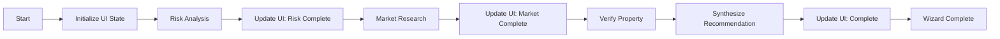

# Mortgage Concierge - Project Registry

> **Version**: 1.2.0  
> **Last Updated**: 2025-12-19  
> **Backup**: `mortgage-concierge-v1.2.0-google-maps-backup.tar.gz`

---

## 📦 Project Structure

```
mortgage-concierge/
├── broker/                    # Orchestrator Agent (Port 4000)
│   └── src/index.ts           # Main broker, workers, API endpoints
├── underwriter/               # Risk Analysis Agent (Port 4001)
│   └── src/index.ts           # Sub-agents: risk-analyst, property-verifier
├── researcher/                # Market Research Agent (Port 4002)
│   └── src/index.ts           # Interest rate research
├── mock-agents/               # Mock endpoints for testing
├── mortgage-concierge-wizard-e2e.bpmn  # Main BPMN workflow
└── *.md                       # Documentation
```

---

## 🔧 Services & Ports

| Service | Port | Description |
|---------|------|-------------|
| Broker | 4000 | Orchestrator, UI backend, Camunda workers |
| Underwriter | 4001 | Risk analysis, property verification |
| Researcher | 4002 | Market research, interest rates |
| Ngrok API | 4040 | Tunnel management dashboard |

---

## 🔑 Master Secrets Registry

> **CRITICAL:** Do not lose these references. This registry maps all API keys to their source locations.

| Scope | Description | Source File Location | Client ID Prefix |
|-------|-------------|----------------------|------------------|
| **Org API** | Console/Modeler Sync | `Org API/CamundaCloudMgmtAPI-Client-agenticIDE_API.sh` | `W9X8...` |
| **Cluster 8.9** | Runtime (Agentic) | `mortgage-concierge/broker/.env` | `PNNBn...` |
| **Cluster 8.8** | Legacy Reference | `Cluster88 API/CamundaCloudMgmtAPI-Client-cluster88API_AgenticIDE.txt` | `XVuw...` |

### Required (.env)
```env
# OpenAI
OPENAI_API_KEY=sk-...
VITE_OPENAI_API_KEY=sk-...

# Camunda Cloud (Zeebe 8.9)
# Source: broker/.env (Synced to root .env)
ZEEBE_CLIENT_ID=PNNBn...
ZEEBE_CLIENT_SECRET=...
ZEEBE_CLOUD_CLUSTER_ID=792e33ba-1b98-47c9-9ce9-abfcea49829b
ZEEBE_CLOUD_REGION=ont-1

# Google Maps (v1.2.0+)
GOOGLE_MAPS_API_KEY=AIzaSy...
```

---

## 🚀 Camunda Cloud Resources

| Resource | ID/Key |
|----------|--------|
| Cluster | `792e33ba-1b98-47c9-9ce9-abfcea49829b` |
| Region | `ont-1` |
| Process ID | `mortgage-concierge-wizard-e2e` |
| Process Version | 11 |
| Process Definition Key | `2251799815155006` |
| Operate URL | https://ont-1.operate.camunda.io/792e33ba-1b98-47c9-9ce9-abfcea49829b |
| Modeler Project | [Mortgage Concierge A2A Swarm](https://modeler.camunda.io/projects/7588e4af-d5ef-4dc1-9efd-266ff1dcccec--mortgage-concierge-a2a-swarm-sequential) |
| Modeler Diagram | [Mortgage Wizard E2E](https://modeler.camunda.io/diagrams/d33a50da-bc47-4c7b-9daf-86ba4fed7365--mortgage-concierge-wizard-e2e-bpmn) |

---

## 🌐 API Endpoints

### Broker (Port 4000)
| Endpoint | Method | Description |
|----------|--------|-------------|
| `/api/wizard/start-mortgage` | POST | Start wizard workflow |
| `/api/session/:id/status` | GET | Poll process status |
| `/api/address/autocomplete` | GET | Google Places autocomplete |
| `/health` | GET | Health check |

### Underwriter (Port 4001)
| Endpoint | Method | Description |
|----------|--------|-------------|
| `/mock/risk-analyst` | POST | A2A risk analysis |
| `/mock/property-verifier` | POST | A2A property verification |
| `/.well-known/agent.json` | GET | Agent card |

### Researcher (Port 4002)
| Endpoint | Method | Description |
|----------|--------|-------------|
| `/mock/interest-rates` | POST | A2A interest rates |
| `/.well-known/agent.json` | GET | Agent card |

---

## 📋 BPMN Workflow Tasks



| Task | Type | Worker |
|------|------|--------|
| Initialize UI State | Service | `initialize-ui-state` |
| Risk Analysis | Service | `analyze-risk` |
| Market Research | Service | `market-research` |
| Verify Property | Service | `verify-property` |
| Synthesize | Service | `synthesize-recommendation` |
| Wizard Complete | Service | `wizard-complete` |

---

## 🧪 Testing Commands

```bash
# Start all services
cd broker && npm run dev &
cd underwriter && npm start &
cd researcher && npm start &
node start-tunnels.js &

# Run E2E test
node e2e-test.js excellent_profile

# Diagnose Camunda state
node diagnose-e2e.js

# Deploy BPMN to Zeebe
cd broker && node -e "const dotenv=require('dotenv');dotenv.config({path:'../.env'});const{ZBClient}=require('camunda-8-sdk').C8;new ZBClient().deployResource({processFilename:'../mortgage-concierge-wizard-e2e.bpmn'}).then(r=>console.log(r))"

# ⚠️ IMPORTANT: After BPMN changes, sync to Web Modeler
cd broker/src && node sync-to-modeler.js
```

### BPMN Update Checklist
Every time you modify `mortgage-concierge-wizard-e2e.bpmn`:
1. ✅ Deploy to Zeebe (creates new version in cluster)
2. ✅ Sync to Modeler: `cd broker/src && node sync-to-modeler.js`
3. ✅ Verify in Modeler: https://modeler.camunda.io/diagrams/d33a50da-bc47-4c7b-9daf-86ba4fed7365

---

## 📁 Backups

| Version | Date | File | Size |
|---------|------|------|------|
| 1.2.0 | 2025-12-19 | `mortgage-concierge-v1.2.0-google-maps-backup.tar.gz` | 157KB |
| 1.0.0 | 2025-12-18 | `mortgage-concierge-v35-stable-backup/` | - |

---

## 🔗 External Dependencies

### Google Cloud APIs
- Places API (New) - Address autocomplete
- Address Validation API - Address verification

### OpenAI
- gpt-4o-mini - Property verification, synthesis

### Camunda 8.9
- Zeebe gRPC API - Process orchestration
- Operate REST API v1 - Process monitoring
