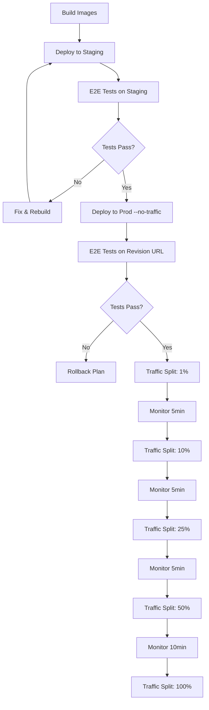

# Release Plan — Gemini Mortgage Concierge Enhancement Release

**Release Date:** 2026-01-20  
**Release Engineer:** Antigravity AI  
**Branch:** `gemini-win-upgrades`  
**Current HEAD:** `2d2a4a1`  
**Release Tag:** `v2.1.0-persona-toggle`

---

## 1. Project & Service Discovery

| Field | Value |
|-------|-------|
| **GCP Project ID** | `gemini3-mortgage-concierge` |
| **Region** | `us-central1` |
| **Platform** | Cloud Run (Managed) |

### Cloud Run Services

| Service | Region | URL | Role |
|---------|--------|-----|------|
| `gemini-frontend` | us-central1 | https://gemini-frontend-231423721146.us-central1.run.app | **ENTRYPOINT** — Public demo UI |
| `gemini-broker` | us-central1 | https://gemini-broker-231423721146.us-central1.run.app | Orchestrator/BFF — Routes requests to agents |
| `gemini-vision` | us-central1 | https://gemini-vision-231423721146.us-central1.run.app | Vision Agent — Property image analysis |
| `gemini-underwriter` | us-central1 | https://gemini-underwriter-231423721146.us-central1.run.app | Underwriter Agent — Loan decision + Files API |
| `gemini-qa` | us-central1 | https://gemini-qa-231423721146.us-central1.run.app | QA Agent — Self-verification |

### Architecture Overview
```
[User Browser] → [gemini-frontend] → [gemini-broker]
                                          ├─→ [gemini-vision]
                                          ├─→ [gemini-underwriter]
                                          └─→ [gemini-qa]
```

### Current Prod Configuration (Snapshot 2026-01-20)

| Service | Current Revision | Image Tag | CPU | Memory | Min/Max Instances |
|---------|-----------------|-----------|-----|--------|-------------------|
| gemini-frontend | gemini-frontend-00007-qbr | :latest | 1 CPU | 512Mi | 1/20 |
| gemini-broker | gemini-broker-00007-k7q | :latest | 1 CPU | 512Mi | 1/5 |
| gemini-vision | (check yaml) | :latest | 1 CPU | 512Mi | 0/5 |
| gemini-underwriter | (check yaml) | :latest | 1 CPU | 512Mi | 0/5 |
| gemini-qa | (check yaml) | :latest | 1 CPU | 512Mi | 0/5 |

**Artifact Registry:** `us-central1-docker.pkg.dev/gemini3-mortgage-concierge/gemini-mortgage/`

**Secrets Used:**
- `DEMO_ACCESS_TOKEN` (broker only) — judge access code validation

---

## 2. Staging Strategy

### Approach: Same Project, `-staging` Suffix

For each production service, create a parallel staging service:

| Prod Service | Staging Service | Notes |
|--------------|-----------------|-------|
| `gemini-frontend` | `gemini-frontend-staging` | UI with "STAGING" banner |
| `gemini-broker` | `gemini-broker-staging` | Points to staging agents |
| `gemini-vision` | `gemini-vision-staging` | |
| `gemini-underwriter` | `gemini-underwriter-staging` | |
| `gemini-qa` | `gemini-qa-staging` | |

**Configuration:**
- Same service account, CPU/mem, concurrency as prod
- Same env var names and secret refs
- Frontend staging points to `gemini-broker-staging` (via VITE_BROKER_URL)
- Broker staging points to staging agent URLs

---

## 3. Build & Deploy Strategy

### Image Tagging
- **Tag Format:** `gcr.io/gemini3-mortgage-concierge/<service>:<git-sha>`
- **Current SHA:** `2d2a4a1`
- **Release Tag:** `v2.1.0`

### Deploy Sequence



### Deploy Commands

**Staging Deploy:**
```bash
gcloud run deploy gemini-frontend-staging \
  --image gcr.io/gemini3-mortgage-concierge/gemini-frontend:2d2a4a1 \
  --region us-central1 \
  --platform managed
```

**Prod Deploy (No Traffic):**
```bash
gcloud run deploy gemini-frontend \
  --image gcr.io/gemini3-mortgage-concierge/gemini-frontend:2d2a4a1 \
  --region us-central1 \
  --platform managed \
  --no-traffic \
  --revision-suffix=v2-1-0
```

**Traffic Shift:**
```bash
gcloud run services update-traffic gemini-frontend \
  --region us-central1 \
  --platform managed \
  --to-revisions gemini-frontend-v2-1-0=10
```

---

## 4. Test Scenarios

### Backend E2E Tests (API Level)

| Scenario | Expected Decision | Expected DTI | Property Score | Risk |
|----------|------------------|--------------|----------------|------|
| **Modern Home** | APPROVED | ~31.6% | 8-10 | Low |
| **Needs Work** | DENIED | ~31.6% | 3-5 | High |
| **Average** | CONDITIONAL/APPROVED | ~31.6% | 6-7 | Medium |

**Assertions per scenario:**
- [ ] `decision` present (string)
- [ ] `dti` numeric present (0-100)
- [ ] `propertyScore` 1-10 present
- [ ] `citations` array present (≥1) with regulation code pattern
- [ ] `filesApiUsed` boolean present
- [ ] `tokensLoaded` present (or explicit n/a reason)
- [ ] `qaChecks` includes DTI verification + pass/fail

### Browser E2E Tests (Playwright)

**Per Scenario:**
1. Navigate to staging URL with `?demo=1`
2. Select scenario (Modern Home / Needs Work / Average)
3. Click "Start Analysis"
4. Assert NO access-code prompt (demo mode bypass)
5. Wait for pipeline completion (currentStep >= 4)
6. Assert Report shows:
   - Decision banner (APPROVED/DENIED)
   - Token Meter visible
   - Citations block visible
   - Clicking citation opens drawer with excerpt
   - QA grid shows DTI formula
   - PDF export triggers download

**Artifact Output:**
```
ops/test-artifacts/
├── 2d2a4a1/
│   ├── backend/
│   │   ├── modern-home.json
│   │   ├── needs-work.json
│   │   └── average.json
│   └── browser/
│       ├── modern-home-screenshot.png
│       ├── needs-work-screenshot.png
│       ├── average-screenshot.png
│       └── trace.zip (on failure)
```

---

## 5. Observability Checklist

### Pre-Deploy Baseline
- [ ] Record current 5xx rate (should be ~0%)
- [ ] Record current p95 latency
- [ ] Record current request count/min

### Post-Deploy Monitoring

| Metric | Threshold | Action if Exceeded |
|--------|-----------|-------------------|
| 5xx Rate | > 1% | Rollback immediately |
| p95 Latency | > 30s | Investigate, rollback if > 60s |
| Error Logs | Any new ERROR patterns | Pause traffic shift |

### Log Queries
```bash
# Check for errors in last 5 minutes
gcloud logging read "resource.type=cloud_run_revision AND severity>=ERROR" \
  --limit 50 \
  --freshness 5m \
  --project gemini3-mortgage-concierge
```

---

## 6. Rollback Plan

### Instant Rollback (< 30 seconds)

If any issues detected, immediately revert traffic:

```bash
# Get current revision receiving traffic
gcloud run services describe gemini-frontend \
  --region us-central1 \
  --platform managed \
  --format="value(status.traffic.revisionName)"

# Revert to previous revision (100% traffic)
gcloud run services update-traffic gemini-frontend \
  --region us-central1 \
  --platform managed \
  --to-revisions PREVIOUS_REVISION=100
```

### Rollback Triggers
- Any E2E test failure on prod revision
- 5xx rate > 1%
- User-reported critical bugs
- Latency spike > 2x baseline

### Post-Rollback Actions
1. Keep new revision at 0% traffic (do not delete)
2. Document failure cause
3. Fix and re-test on staging
4. Re-attempt deploy after fix

---

## 7. Execution Checklist

### Phase 0: Discovery ✅
- [x] Set gcloud project
- [x] List all Cloud Run services
- [x] Identify entrypoint (gemini-frontend)
- [x] Identify backend services
- [x] Create this release plan
- [ ] Commit release plan

### Phase 1: Snapshot Prod Config
- [ ] Export gemini-frontend config
- [ ] Export gemini-broker config
- [ ] Export gemini-vision config
- [ ] Export gemini-underwriter config
- [ ] Export gemini-qa config
- [ ] Record current image digests
- [ ] Record current revisions receiving traffic

### Phase 2: Staging Deploy
- [ ] Create gemini-frontend-staging
- [ ] Create gemini-broker-staging
- [ ] Create gemini-vision-staging
- [ ] Create gemini-underwriter-staging
- [ ] Create gemini-qa-staging
- [ ] Verify /health endpoints
- [ ] Verify UI loads with STAGING banner

### Phase 3: Tests
- [ ] Write backend E2E tests
- [ ] Write browser E2E tests
- [ ] Run tests against staging
- [ ] All scenarios pass
- [ ] Save test artifacts

### Phase 4: Prod Deploy (No Traffic)
- [ ] Deploy gemini-frontend --no-traffic
- [ ] Deploy gemini-broker --no-traffic
- [ ] Deploy agent services --no-traffic (if changed)
- [ ] Verify revision URLs accessible
- [ ] Run E2E tests against revision URLs

### Phase 5: Traffic Shift
- [ ] 1% traffic → monitor 5min
- [ ] 10% traffic → monitor 5min
- [ ] 25% traffic → monitor 5min
- [ ] 50% traffic → monitor 10min
- [ ] 100% traffic → final verification

### Phase 6: Documentation
- [ ] Update README with demo mode instructions
- [ ] Update JUDGES.md with proof mode + token meter
- [ ] Add E2E test instructions
- [ ] Document traffic splitting approach

---

## 8. Contacts & Escalation

| Role | Contact |
|------|---------|
| Release Engineer | Antigravity AI |
| GCP Admin | Project Owner |
| Rollback Authority | Immediate (any engineer can rollback) |

---

## Appendix: Service Dependencies

```yaml
gemini-frontend:
  depends_on: []
  env:
    VITE_BROKER_URL: https://gemini-broker-*.run.app

gemini-broker:
  depends_on:
    - gemini-vision
    - gemini-underwriter
    - gemini-qa
  env:
    VISION_AGENT_URL: https://gemini-vision-*.run.app
    UNDERWRITER_AGENT_URL: https://gemini-underwriter-*.run.app
    QA_AGENT_URL: https://gemini-qa-*.run.app

gemini-vision:
  depends_on: []
  env:
    GEMINI_API_KEY: (secret)

gemini-underwriter:
  depends_on: []
  env:
    GEMINI_API_KEY: (secret)
    REGULATIONS_FILE: (Files API)

gemini-qa:
  depends_on: []
  env:
    GEMINI_API_KEY: (secret)
```
